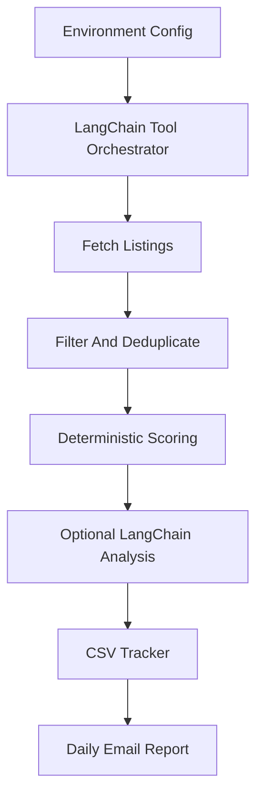

# HomeScoutAgent

HomeScoutAgent is a LangChain-powered real estate scouting assistant that turns daily property searches into a ranked, explainable email report.

The project combines deterministic filtering and scoring with optional LLM analysis. The deterministic layer decides which homes rank highest; LangChain adds concise finalist commentary, field-level risk/value notes, and an email-ready summary without taking control of ranking or side effects.

## Why This Project Matters

Real estate search tools are noisy. A buyer often has to check multiple cities, filter out stale or poor-fit listings, compare tradeoffs, and keep track of what has already been reviewed. HomeScoutAgent automates that workflow:

- Searches multiple Realtor.com locations on a schedule.
- Applies hard filters for budget, beds, baths, square footage, lot size, year built, HOA, property type, and school ratings.
- Deduplicates overlapping listings across nearby cities.
- Scores every candidate with transparent, deterministic logic.
- Uses LangChain for optional qualitative finalist analysis.
- Sends an HTML and plain-text email with the best homes.
- Maintains a readable CSV tracker and skips homes already seen on prior runs.

## Architecture



The orchestration lives in `agent/langchain_agent.py`. LangChain wraps the workflow steps as tools, while the core business logic stays in normal Python modules. This keeps the system easy to test and prevents the LLM from inventing listing data, changing ranking order, or sending email outside the controlled pipeline.

## Feature Highlights

- **Explainable ranking:** Every property gets a `score`, `score_reason`, `score_breakdown`, `detailed_analysis`, and `red_flags`.
- **LangChain integration:** Finalist summaries use structured LangChain output so downstream email and tracker fields remain stable.
- **Provider-ready model layer:** `agent/langchain_models.py` centralizes model creation. OpenAI is the default provider today.
- **Production-minded workflow:** The job supports dry runs, scheduled local runs, GitHub Actions runs, test gates, dependency auditing, and tracker artifacts.
- **Human-readable tracking:** The report tracker is intentionally easy to review instead of being a raw data dump.
- **Safety-first side effects:** Email sending and tracker writes happen through deterministic Python functions, not open-ended LLM decisions.

## Project Structure

```text
agent/
  config.py             Environment parsing and validation
  fetcher.py            Realtor.com listing fetch, filtering, and deduplication
  scoring.py            Deterministic scoring and ranking
  langchain_agent.py    LangChain tool orchestration for the daily workflow
  langchain_models.py   Configurable LangChain chat model factory
  llm_scorer.py         Structured LangChain finalist analysis
  tracker.py            CSV tracker persistence and duplicate skipping
  emailer.py            HTML/plain-text email rendering and SMTP sending
  main.py               CLI entrypoint and local scheduler

homeharvest/            Bundled HomeHarvest scraping library
tests/                  Unit tests plus optional live integration tests
.github/workflows/      Scheduled GitHub Actions workflow
```

## Quick Start

### 1. Install

```bash
python -m pip install -e .
```

### 2. Configure

Copy the example environment file and fill in your values:

```bash
cp .env.example .env
```

On Windows PowerShell:

```powershell
Copy-Item .env.example .env
```

### 3. Run A Dry Run

Set `DRY_RUN=true` in `.env`, then run:

```bash
python -m agent.main
```

Dry-run mode prints the email content instead of sending it. This is the safest first check after changing filters, email settings, or LangChain configuration.

### 4. Send A Real Email

After the dry run looks correct, set:

```env
DRY_RUN=false
```

Then run:

```bash
python -m agent.main
```

## Configuration

The app is configured through environment variables. The real `.env` file is ignored by Git; `.env.example` is safe to commit.

### Required Variables

| Variable | Purpose |
| --- | --- |
| `REAL_ESTATE_LOCATIONS` | Semicolon-separated search locations, such as `Santa Clara, CA;Sunnyvale, CA` |
| `PRICE_MIN` | Minimum listing price |
| `PRICE_MAX` | Maximum listing price |
| `EMAIL_FROM` | Sender email address |
| `EMAIL_TO` | One or more recipients, comma-separated |
| `SMTP_HOST` | SMTP server host |
| `SMTP_PORT` | SMTP server port |
| `SMTP_USERNAME` | SMTP login username |
| `SMTP_PASSWORD` | SMTP login password or app password |

### Important Optional Variables

| Variable | Default | Purpose |
| --- | --- | --- |
| `LISTING_TYPE` | `for_sale` | Listing type passed to HomeHarvest |
| `PROPERTY_TYPES` | empty | Comma-separated property types |
| `BEDS_MIN`, `BEDS_MAX` | empty | Bedroom range |
| `BATHS_MIN`, `BATHS_MAX` | empty | Bathroom range |
| `SQFT_MIN`, `SQFT_MAX` | empty | Interior square-footage range |
| `LOT_SQFT_MIN`, `LOT_SQFT_MAX` | empty | Lot-size range |
| `YEAR_BUILT_MIN`, `YEAR_BUILT_MAX` | empty | Year-built range |
| `HOA_MAX` | empty | Maximum HOA fee |
| `MIN_ASSIGNED_PRIMARY_SCHOOL_RATING` | `8` | Minimum assigned primary/elementary school rating |
| `MIN_ASSIGNED_MIDDLE_SCHOOL_RATING` | `8` | Minimum assigned middle school rating |
| `MIN_ASSIGNED_HIGH_SCHOOL_RATING` | `8` | Minimum assigned high school rating |
| `PAST_DAYS` | `7` | Listing freshness window |
| `LIMIT_PER_LOCATION` | `100` | Max listings fetched per location |
| `TOP_N` | `5` | Number of homes included in the report |
| `REPORT_TRACKER_PATH` | `reports/live_report_tracker.csv` | CSV tracker location |
| `DRY_RUN` | `false` | Print email instead of sending it |

### LangChain And LLM Settings

| Variable | Default | Purpose |
| --- | --- | --- |
| `ENABLE_OPENAI_SCORING` | `false` | Enables optional LangChain finalist analysis. The name is retained for backward compatibility. |
| `LANGCHAIN_PROVIDER` | `openai` | LLM provider. OpenAI is currently supported. |
| `LANGCHAIN_MODEL` | `OPENAI_MODEL` or `gpt-4.1-mini` | Model used by LangChain |
| `LANGCHAIN_TEMPERATURE` | `0` | Model temperature |
| `LANGCHAIN_API_KEY` | `OPENAI_API_KEY` | Provider API key override |
| `OPENAI_API_KEY` | empty | OpenAI API key |
| `OPENAI_MODEL` | `gpt-4.1-mini` | Backward-compatible model setting |

If `ENABLE_OPENAI_SCORING=true` but no API key is configured, the app logs a warning and safely skips LLM enrichment. The deterministic ranking and email workflow still run.

## Example `.env`

```env
REAL_ESTATE_LOCATIONS=Santa Clara, CA;Sunnyvale, CA;Mountain View, CA;Cupertino, CA
LISTING_TYPE=for_sale

PRICE_MIN=700000
PRICE_MAX=1200000

PROPERTY_TYPES=single_family,condos,townhomes
BEDS_MIN=2
BATHS_MIN=2
SQFT_MIN=900
YEAR_BUILT_MIN=1970
HOA_MAX=600
MIN_ASSIGNED_PRIMARY_SCHOOL_RATING=8
MIN_ASSIGNED_MIDDLE_SCHOOL_RATING=8
MIN_ASSIGNED_HIGH_SCHOOL_RATING=8

PAST_DAYS=7
LIMIT_PER_LOCATION=100
TOP_N=5

SUBJECTIVE_CRITERIA=Prefer homes with good resale potential, low HOA, safe neighborhood, good schools, reasonable commute, newer or remodeled condition, and strong value relative to price per square foot.
POSITIVE_KEYWORDS=remodeled,updated,excellent schools,quiet,new roof,solar,corner lot,move-in ready
NEGATIVE_KEYWORDS=fixer,TLC,as-is,auction,needs work,fire damage,foundation

ENABLE_OPENAI_SCORING=false
LANGCHAIN_PROVIDER=openai
LANGCHAIN_MODEL=gpt-4.1-mini
LANGCHAIN_TEMPERATURE=0
OPENAI_API_KEY=
LANGCHAIN_API_KEY=

REPORT_TRACKER_PATH=reports/live_report_tracker.csv
SCHEDULE_TIME=17:00
UPDATE_FREQUENCY=daily

EMAIL_FROM=your_email@gmail.com
EMAIL_TO=your_email@gmail.com,partner@example.com
SMTP_HOST=smtp.gmail.com
SMTP_PORT=587
SMTP_USERNAME=your_email@gmail.com
SMTP_PASSWORD=your_gmail_app_password

DRY_RUN=true
```

## How Ranking Works

The LLM does not decide the ranking. Homes are ranked deterministically using:

- Price position within the configured budget.
- Price per square foot compared with the fetched result-set median.
- Square footage and bed/bath fit.
- Year built.
- HOA fee.
- Assigned GreatSchools ratings.
- Days on market.
- Positive and negative keyword matches.
- Overlap with the subjective criteria text.

Each finalist includes:

- `score`
- `score_reason`
- `red_flags`
- `score_breakdown`
- `detailed_analysis`

This design makes the output explainable and reviewable. LangChain adds narrative context after the deterministic ranking is complete.

## Email Report

Each email includes:

- Search criteria.
- Fetch warnings if one location fails but others succeed.
- Ranked properties with score, price, address, beds, baths, square footage, HOA, days on market, and links.
- Explanation of why each home ranked.
- Possible concerns and red flags.
- Optional LangChain field scores for safety, neighborhood, appreciation, schools, commute, value, condition, and risk.
- Primary photo when available.

The email is generated in both plain text and HTML.

## Live Report Tracker

Each run appends new top picks to `REPORT_TRACKER_PATH`, which defaults to:

```text
reports/live_report_tracker.csv
```

The tracker is intentionally readable. It starts with `House`, `Address`, `Overall Score`, and `Overall Comment`, then includes field-level LangChain score/comment pairs such as `Safety Score`, `Safety Comment`, `Appreciation Score`, and `Appreciation Comment`. The final column is `Zillow Link`.

If the same home appears again in a later run, it is skipped instead of duplicated.

## Running On A Schedule

### Local Scheduler

Run once immediately, then keep the scheduler alive:

```bash
python -m agent.main --run-now-and-schedule
```

The local scheduler uses:

- `SCHEDULE_TIME`, for example `17:00`
- `UPDATE_FREQUENCY`, either `daily` or `hourly`

The local scheduler only works while the machine is awake and the process is running.

### Convenience Launchers

Windows:

```bat
run_daily_agent.bat
```

macOS/Linux:

```bash
./run_daily_agent.command
```

Stop the local scheduler:

```bash
python -m agent.main --stop-scheduler
```

## GitHub Actions

The workflow in `.github/workflows/daily-real-estate-agent.yml` supports:

- Manual runs through `workflow_dispatch`.
- Daily scheduled cloud runs.
- Unit tests before the scheduled agent runs.
- Ruff lint checks.
- Mypy type checks.
- Dependency auditing.
- Report tracker cache restore.
- Report tracker artifact upload.

For cloud runs, add the same values from `.env` as GitHub Actions secrets, then set:

```env
DRY_RUN=false
```

The workflow schedule is controlled by the cron expression in the workflow file. `SCHEDULE_TIME` and `UPDATE_FREQUENCY` only apply to the local scheduler.

## Testing

Run the default test suite:

```bash
python -m pytest
```

Run lint and type checks:

```bash
ruff check agent tests/test_agent.py
mypy agent
```

Live Realtor.com integration tests are marked as `integration` and skipped by default. Run them explicitly only when you want to test against live external data:

```bash
python -m pytest -m integration
```

## Production Readiness Notes

This project is designed for reliable personal automation and public demonstration:

- Configuration is validated with Pydantic.
- External fetch failures are captured per location so one bad location does not automatically cancel the whole report.
- The app supports dry-run mode before sending real email.
- LLM enrichment is optional and fails closed.
- CI runs tests, lint, type checks, and dependency audit.
- Secrets are expected to live in `.env` locally or GitHub Actions secrets in the cloud.

External dependencies still matter. A live run depends on Realtor.com availability, SMTP availability, valid credentials, and optional LLM provider access.

## SMTP Notes

For Gmail:

1. Enable 2-Step Verification.
2. Create a Gmail App Password.
3. Use that App Password as `SMTP_PASSWORD`.
4. Set `SMTP_HOST=smtp.gmail.com`.
5. Set `SMTP_PORT=587`.

## Compliance

This project uses the HomeHarvest Realtor.com scraping interface as-is.

- It does not scrape Zillow directly.
- It does not bypass anti-bot protections.
- Users are responsible for complying with the terms of the source websites, LLM providers, and email providers they use.

## Roadmap

Potential future improvements:

- Additional LangChain providers beyond OpenAI.
- A small dashboard for reviewing tracker history.
- Richer neighborhood-level data sources.
- Notification channels beyond email.
- Stronger artifact persistence for long-running cloud deployments.
